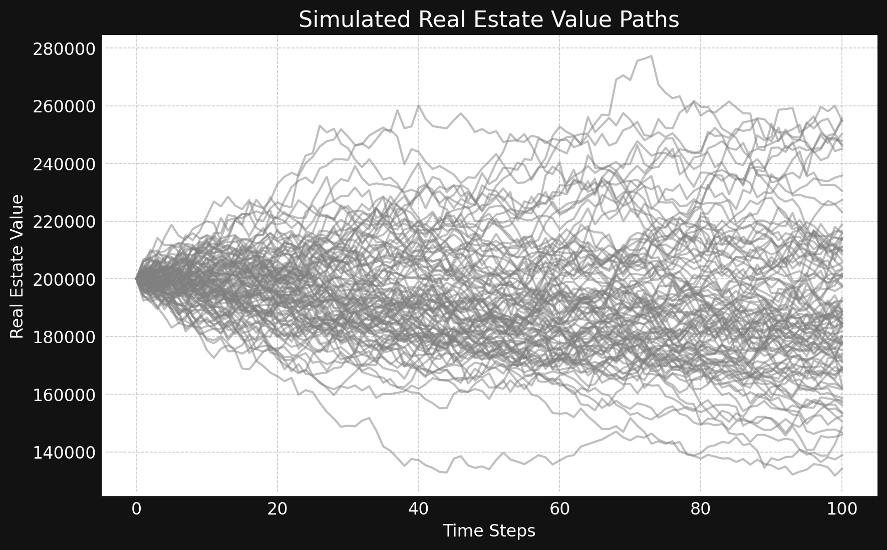
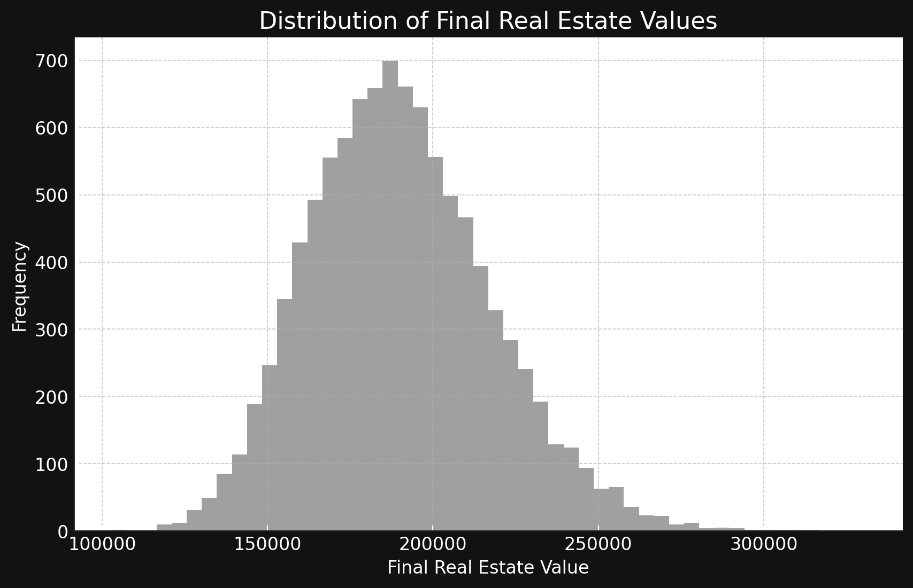

# BSREOptions: Black-Scholes Real Estate Options
BSREOptions offers an adaptation of the traditional Black-Scholes model, tailored specifically for the unique dynamics of real estate options. This repository presents an implementation designed to evaluate lease options in real estate, integrating stochastic interest rates and property value volatility. BSREOptions is fundamentally an educational tool, not production-grade pricing software; it is a compact, inspectable model for learning and experimentation.

The repository contains:
* `BSREOptions`: core simulation and pricing engine
* `visuals`: dark-themed plotting helpers for simulated paths and distributions
* A minimal CLI entry point exposed as `bsre-options`
* Tests and CI wiring for reproducibility and basic correctness


## Applications
The BSREOptions model can be used in illustrative form across several real-estate and finance contexts:
* **Real estate development and investment**
  Explore how lease option values respond to interest rates, volatility, and lease yields.
* **REITs and portfolio management**
  Prototype approaches to valuing lease options across portfolios under different rate and volatility regimes.
* **Lease negotiation**
  Build intuition about how option moneyness, yield, and timing affect the economic value of embedded lease options.
* **Financing and lending**
  Examine sensitivity of option value to funding costs via the short-rate process and carry assumptions.
* **Risk and scenario analysis**
  Perform scenario analysis with correlated property and rate shocks to understand downside or upside tails.

## Black-Scholes shortcomings
Classical Black-Scholes relies on simplifying assumptions that are often poor fits for real estate:
* **Illiquidity and transaction frictions**
  Properties do not trade continuously, bid-ask spreads are large, and execution is slow.
* **Non-traded underlying and idiosyncratic risk**
  The “underlying” is a specific property or project, not a liquid security.
* **Interest rate dynamics**
  Constant interest rates are inadequate for long-dated leases and financing structures.
* **Volatility structure**
  Real estate value uncertainty is driven by both macro and local factors, and effective volatility is time-varying.

BSREOptions addresses some of these issues in a minimal way by:
* Modeling the short rate with a mean-reverting CIR-style process.
* Modeling the variance of the property value as its own mean-reverting process.
* Allowing a continuous lease/dividend yield `q` and an additional `carry_cost` term in the drift.


## How others can use this repository
This repository is aimed at:
* Developers interested in financial Monte Carlo implementations in Python.
* Quantitative and real-estate analysts exploring lease option valuation ideas.
* Students who want a small, fully contained example of stochastic short rates and variance.


## Parameters and reference table
`BSREOptions` is initialized with the following arguments:

```python
from bsre_options import BSREOptions

model = BSREOptions(
    V0=200_000.0,
    K=220_000.0,
    T=1.0,
    r0=0.03,
    kappa_r=0.3,
    theta_r=0.03,
    sigma_r=0.01,
    v0=0.02,
    kappa_v=1.0,
    theta_v=0.02,
    sigma_v=0.1,
    rho=-0.5,
    q=0.02,
    carry_cost=0.0,
    M=100,
    I=10_000,
    seed=123,
)
```

### Argument reference

| Argument     | Type         | Description                                                                                                               | Typical ranges         |
| ------------ | ------------ | ------------------------------------------------------------------------------------------------------------------------- | ---------------------- |
| `V0`         | `float`      | Initial real estate value at time 0 (current property value).                                                             | $100,000 – $10,000,000 |
| `K`          | `float`      | Option strike price for the lease option (exercise price on the property value).                                          | $100,000 – $10,000,000 |
| `T`          | `float`      | Time to maturity in years.                                                                                                | 0.25 – 10              |
| `r0`         | `float`      | Initial short rate level.                                                                                                 | 0.0 – 0.10             |
| `kappa_r`    | `float`      | Mean-reversion speed of the short rate (CIR style). Higher values pull `r_t` faster towards `theta_r`.                    | 0.1 – 3.0              |
| `theta_r`    | `float`      | Long-run mean level of the short rate.                                                                                    | 0.0 – 0.10             |
| `sigma_r`    | `float`      | Volatility of the short rate.                                                                                             | 0.001 – 0.5            |
| `v0`         | `float`      | Initial variance of the property value process (note: **variance**, not volatility).                                      | 0.01 – 0.25            |
| `kappa_v`    | `float`      | Mean-reversion speed of the variance process.                                                                             | 0.1 – 3.0              |
| `theta_v`    | `float`      | Long-run mean variance level of the property value process.                                                               | 0.01 – 0.25            |
| `sigma_v`    | `float`      | Volatility of the variance process.                                                                                       | 0.01 – 1.0             |
| `rho`        | `float`      | Correlation between property value shocks and rate shocks. Must lie in `[-1, 1]`.                                         | −1.0 – 1.0             |
| `q`          | `float`      | Non-negative continuous lease/dividend yield as a fraction of property value per year. Acts as a drag on the asset drift. | 0.0 – 0.10             |
| `carry_cost` | `float`      | Additional carry term in the property value drift. Positive values increase drift; negative values represent extra costs. | −0.10 – 0.10           |
| `M`          | `int`        | Number of time steps in each simulation path.                                                                             | 10 – 1,000             |
| `I`          | `int`        | Number of Monte Carlo paths.                                                                                              | 1,000 – 100,000+       |
| `seed`       | `int`/`None` | Seed for `numpy.random.default_rng`. Controls reproducibility; `None` uses entropy-based seeding.                         | Any integer or `None`  |

Basic validation is enforced:
* `q` must be non-negative.
* `rho` must lie in `[-1, 1]`.
* `M` and `I` must be positive integers.

## Quickstart
This section sketches a minimal workflow using the core engine and the plotting utilities.

### 1. Python usage
Create a model and price a lease option:
```python
from bsre_options import BSREOptions

model = BSREOptions(
    V0=200_000.0,
    K=220_000.0,
    T=1.0,
    r0=0.03,
    kappa_r=0.3,
    theta_r=0.03,
    sigma_r=0.01,
    v0=0.02,
    kappa_v=1.0,
    theta_v=0.02,
    sigma_v=0.1,
    rho=-0.5,
    q=0.02,
    carry_cost=0.0,
    M=100,
    I=10_000,
    seed=123,
)
price = model.value_option()
print(f"Estimated lease option value: {price:.2f}")
```

To obtain Monte Carlo error estimates and a 95% confidence interval:
```python
price, stderr, (ci_low, ci_high) = model.value_option(price_only=False)
print(f"Price: {price:.4f}")
print(f"Std. error: {stderr:.4f}")
print(f"95% CI: [{ci_low:.4f}, {ci_high:.4f}]")
```

### 2. Simulating paths
You can access the simulated property values and short rates directly:
```python
V, r = model.simulate_paths()
print(V.shape)  # (M + 1, I)
print(r.shape)  # (M + 1, I)
```

Here:
* `V[t, i]` is the property value at time step `t` on path `i`.
* `r[t, i]` is the short rate at the same point.

### 3. Command-line usage
After installation, a small CLI is available:
```bash
bsre-options --V0 200000 --K 220000 --T 1.0 --I 10000 --M 100
```

Key arguments (all optional, with defaults):

```text
--V0          initial property value
--K           option strike
--T           time to maturity in years
--r0          initial short rate
--kappa-r     short-rate mean reversion speed
--theta-r     short-rate long-run mean
--sigma-r     short-rate volatility
--v0          initial variance for property value
--kappa-v     variance mean reversion speed
--theta-v     long-run variance level
--sigma-v     variance volatility
--rho         asset–rate correlation
--q           continuous lease/dividend yield
--carry-cost  extra carry term in asset drift
--M           number of time steps
--I           number of Monte Carlo paths
--seed        random seed
```

The CLI prints a single line with the estimated option value:

```text
estimated option value: 12345.678900
```

## Visualization helpers (`visuals` module)
The `visuals` module provides dark-themed plots for simulated data using `matplotlib`.

```python
import numpy as np
from pathlib import Path

from bsre_options import BSREOptions
from visuals import (
    plot_paths,
    plot_final_distribution,
    plot_rate_value_heatmap,
)

model = BSREOptions(
    V0=200_000.0,
    K=220_000.0,
    T=1.0,
    r0=0.03,
    kappa_r=0.3,
    theta_r=0.03,
    sigma_r=0.01,
    v0=0.02,
    kappa_v=1.0,
    theta_v=0.02,
    sigma_v=0.1,
    rho=-0.5,
    q=0.02,
    carry_cost=0.0,
    M=100,
    I=10_000,
    seed=123,
)

V, r = model.simulate_paths()

# path plot
fig_paths = plot_paths(V, r, max_paths=100, show=True, save_path=Path("assets/paths.png"))

# histogram of terminal values
fig_hist = plot_final_distribution(V, show=True, save_path=Path("assets/final_dist.png"))

# joint distribution of (r, V)
fig_heat = plot_rate_value_heatmap(r, V, show=True, save_path=Path("assets/rate_value_heatmap.png"))
```


### Simulated real estate value paths
`plot_paths` visualizes a subset of simulated property value paths over time:
* Each line represents one Monte Carlo scenario for the property value.
* The maximum number of drawn paths is controlled by `max_paths`.
* The plot uses a dark background with gray paths for visual contrast.

### Distribution of final real estate values
`plot_final_distribution` plots a histogram of `V_T`, the terminal property values:
* The number of bins is controlled by `bins`.
* The figure shows the empirical distribution across all simulated paths.

### Heatmap of interest rates and values
`plot_rate_value_heatmap` creates a 2D histogram over all `(r_t, V_t)` pairs across time and scenarios:
* Both the short rate and property value arrays are flattened.
* A 2D histogram is computed and displayed as a gray-scale heatmap.


## Simulated Real Estate Value Paths
Visualization helps in understanding how real estate values might change over time under different scenarios, providing insights into the variability and risk associated with real estate investments. Each gray line represents a possible trajectory of real estate value, starting from an initial value and evolving according to specified market dynamics and random fluctuations.



## Distribution of Final Real Estate Values
The distribution of final real estate values across all simulated scenarios at the end of the specified time period. This gauges the spread of possible end values, highlighting the risks and opportunities in real estate investments based on the model's assumptions and parameters.




## Output interpretation
The main numerical output of BSREOptions is the estimated value of a European call option on the terminal property value:

* **Option payoff**: `max(V_T − K, 0)` on each path.
* **Discounting**: Each payoff is discounted using the pathwise integral of the simulated short rate.
* **Price**: The Monte Carlo estimate is the average of discounted payoffs across all paths.

When calling:

```python
price = model.value_option()
```

you obtain a single float, the Monte Carlo price under the chosen parameters.

When calling:

```python
price, stderr, (ci_low, ci_high) = model.value_option(price_only=False)
```

you additionally obtain:

* `stderr`: the standard error of the Monte Carlo estimate.
* `(ci_low, ci_high)`: a 95% confidence interval based on a normal approximation.

Interpretation guidelines:

* A **higher** option value indicates more valuable upside at maturity, given the current property value, strike, and process parameters.
* Values **close to zero** indicate an option that is at, or out of, the money in most simulated scenarios under the current assumptions.
* The **confidence interval width** reflects Monte Carlo noise; tightening it requires more paths (`I`) or variance-reduction techniques (not implemented here).


## Conclusion

* **Educational focus**: BSREOptions is designed as a compact, inspectable example of Monte Carlo pricing with stochastic short rates and variance in a real-estate context.
* **Extensible**: The structure is intentionally simple, making it a convenient starting point for experimenting with alternative dynamics, payoffs, or calibration schemes.
* **Practical takeaway**: Use the model to explore how assumptions about rates, variance, yields, and carry interact, not as a calibrated production pricing engine.
